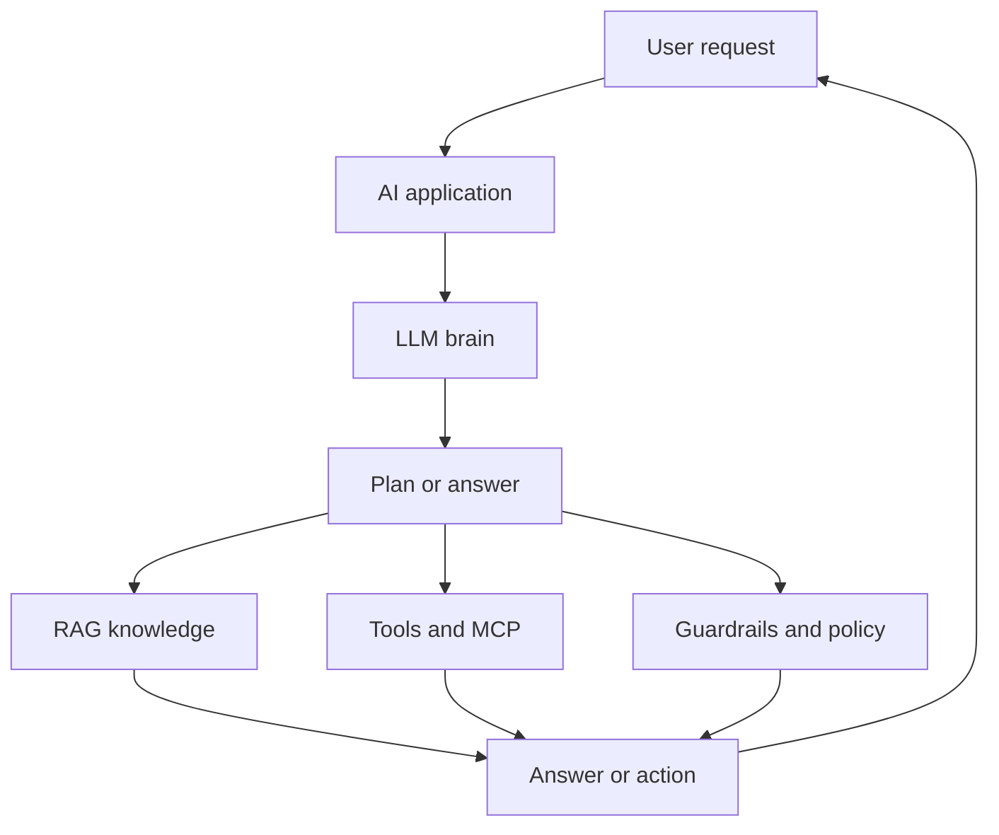

# AI Agent and Security Wiki

This wiki explains modern AI systems, agent skills, and agentic security in a simple, practical way.

> **TL;DR:**  
> A modern AI system is like a software person:  
> it has a brain, it learns, it reads external knowledge, it uses tools, it follows rules, and it needs guardrails.

---

## High-level mental model

| Human idea | AI idea | What it does |
|---|---|---|
| Brain | LLM | Core reasoning and language generation |
| School | Training and tuning | Teaches the model language, patterns, and behavior |
| Books and news | RAG | Adds current or specific external knowledge |
| Hands and feet | Tools and agents | Lets the AI take actions |
| Nervous system | MCP | Connects and coordinates model, tools, and data |
| Rules and ethics | System prompts | Guides safe and acceptable behavior |
| Guardrails and policy | Security controls | Prevents unsafe, private, or unauthorized actions |

---

## Big picture diagram

---

## Navigation map

| Section | Start here | Link |
|---|---|---|
| Modern AI basics | Core concepts | [01. Modern AI Basics](01-Modern-AI-Basics) |
| LLM explanation | The brain | [02. LLM Brain](02-LLM-Brain) |
| Training and tuning | How models learn | [03. Training and Tuning](03-Training-Tuning) |
| RAG | External knowledge | [04. RAG](04-RAG) |
| Agents and tools | Taking actions | [05. AI Agents and Tools](05-AI-Agents-Tools) |
| MCP | Tool and data coordination | [06. MCP](06-MCP) |
| System prompts and guardrails | Rules and safety | [07. System Prompts and Guardrails](07-System-Prompts-Guardrails) |
| Agent skills | Practical skill design | [08. Agent Skills Overview](08-Agent-Skills-Overview) |
| Security overview | Agentic security | [20. Security Overview](20-Security-Overview) |
| Security checklist | Launch readiness | [29. Security Checklist](29-Security-Checklist) |
| Glossary | Quick definitions | [Glossary](Glossary) |

---

## Read this wiki in this order

1. [01. Modern AI Basics](01-Modern-AI-Basics)
2. [02. LLM Brain](02-LLM-Brain)
3. [03. Training and Tuning](03-Training-Tuning)
4. [04. RAG](04-RAG)
5. [05. AI Agents and Tools](05-AI-Agents-Tools)
6. [06. MCP](06-MCP)
7. [07. System Prompts and Guardrails](07-System-Prompts-Guardrails)
8. [08. Agent Skills Overview](08-Agent-Skills-Overview)
9. [20. Security Overview](20-Security-Overview)
10. [29. Security Checklist](29-Security-Checklist)

---

## Core idea

A useful AI system is not just a model.

It is:

> A trained brain,  
> grounded with external knowledge,  
> connected to tools,  
> coordinated through protocols,  
> constrained by clear rules,  
> and protected by security controls.
